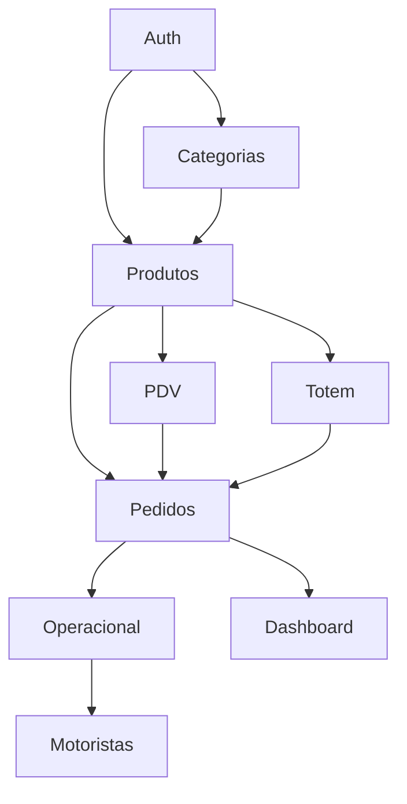
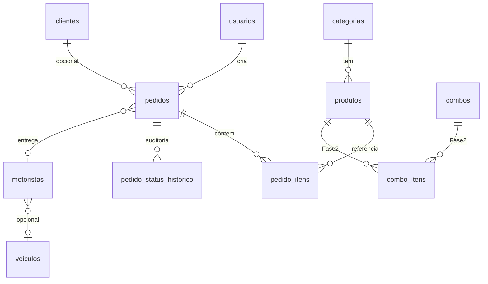

# Ligeirinho Hub — Architecture

> **Fonte da verdade arquitetural** do projeto. Todas as decisões técnicas futuras devem respeitar este documento.  
> **Versão:** 1.0 · **Última atualização:** 2026-05-21  
> **Referência operacional:** inspirado no padrão maduro do [RG Ambiental](../RGAmbiental.pdf) (SPA modular + Supabase + RLS por cargo).

Documentação detalhada (Notion): ver seção [Documentação complementar](#documentação-complementar).

---

## 1. Visão Geral do Sistema

O **Ligeirinho Hub** é o sistema sob medida da adega para unificar **venda**, **operação** e **gestão** em um ecossistema web modular (PWA), com um único backend Supabase e deploy na Vercel.

### Ecossistema macro

```text
PDV (caixa) ──┐
Totem (tablet)├──► Pedido único (PostgreSQL) ──► Operacional (fila)
Delivery ─────┘         │                              │
                        ▼                              ▼
                 NEXUS Hub (gestão)            Motorista / Entrega
                        │                              │
                        └──────────► Dashboard ◄───────┘
                                          │
                              Active Entregas (Fase 2)
```

- **PDV** — venda no balcão, caixa, pagamento imediato.
- **Totem** — autoatendimento do cliente (pedido → pagamento no caixa no MVP).
- **Operacional** — fila, preparo, separação, despacho.
- **NEXUS Hub** — painel administrativo (cadastros, usuários, dashboard, configurações). Nome de produto; arquivos sem sufixo `NEXUS`.
- **Active Entregas** — integração logística (Fase 2).

### Objetivo e visão de produto

| Dimensão | Descrição |
|----------|-----------|
| **Problema** | Vendas, estoque e entrega desconectados; sem rastreio pós-venda; cardápio inconsistente entre canais. |
| **Solução** | Um pedido, um ID, um banco; cardápio centralizado; realtime na operação. |
| **Princípio** | Herdar **padrão maduro** do RG Ambiental, adaptado ao domínio **adega** — não copiar domínio de coleta/resíduos. |

---

## 2. Objetivo do MVP

Critério de corte da Fase 1: *«A loja consegue operar 100% com esse conjunto?»*  
Detalhamento validado em `Limites da Fase 1` (Notion).

### Entram no MVP (Fase 1)

| Área | Escopo |
|------|--------|
| **Auth** | Login, sessão, cargos, logout |
| **Dashboard básico** | Vendas/pedidos do dia, ticket médio, status operacional |
| **Produtos** | CRUD, estoque simples, disponibilidade (sem imagens no MVP) |
| **Categorias** | CRUD |
| **PDV** | Busca, carrinho, pagamento (dinheiro/cartão/PIX manual), caixa, pedido |
| **Totem** | Cardápio, carrinho, pedido aguardando pagamento no caixa |
| **Operacional** | Fila, status, separação, realtime |
| **Motoristas** | Cadastro, atribuição manual, em rota / entregue |
| **PWA** | Instalável, responsivo (tablet + celular) |
| **Realtime** | Fila operacional e dashboard sem refresh manual |

> **Nota:** Combos, imagens de produto e PIX automático no totem estão na **Fase 2** (ver `Backlog — Fase 2`).

### Fora do MVP

| Item | Fase |
|------|------|
| Combos | 2 |
| WhatsApp | 2 |
| Cayena | Fora do escopo atual (B2B) |
| CRM, cashback, fidelidade | 2–3 |
| IA / NEXUS analytics | 3 |
| Multi-loja | 3 |
| BI avançado, relatórios históricos | 2 |
| Active Entregas (API) | 2 |
| NFC-e fiscal completo | 3 |

**Prazo alvo Fase 1:** 30–45 dias (6 sprints). Go-live possível após PDV + Operacional + Dashboard; Totem pode fechar a fase.

---

## 3. Stack Oficial

### Frontend

| Tecnologia | Papel |
|------------|--------|
| **React 19** | UI declarativa, ecossistema estável |
| **TypeScript** | Tipos fortes, contratos com Supabase |
| **Vite 6** | Build rápido, HMR, PWA plugin |
| **React Router 7** | Rotas, layouts, lazy loading |
| **PWA** | PDV/Totem/Motorista em tablet sem app store |

### Backend (Supabase)

| Serviço | Papel |
|---------|--------|
| **PostgreSQL** | Fonte da verdade relacional |
| **Auth** | E-mail/senha; perfil em `usuarios` |
| **RLS** | Segurança por cargo — barreira final |
| **Storage** | Imagens produto, comprovantes (Fase 2) |
| **Realtime** | Fila de pedidos, status, entregas |
| **Edge Functions** | Admin de usuários, webhooks (Fase 2) |

### Infra e integrações

| Serviço | Papel |
|---------|--------|
| **Vercel** | Hosting SPA, preview, env `VITE_*` |
| **Resend** | E-mail transacional (Fase 2) |
| **MCP Notion** | Documentação de produto/arquitetura |
| **Active Entregas** | Logística integrada (Fase 2) |

### Justificativas

- **Supabase:** Auth + RLS + Realtime + Edge em um projeto; padrão já validado no RG Ambiental.
- **React + Vite:** Mesma stack do RG; curva de aprendizado menor; deploy estático na Vercel.
- **PWA:** Adega opera em tablet/caixa; instalação sem loja de apps.
- **Uma SPA (Fase 1):** Menor complexidade operacional que múltiplos deploys; lazy por módulo mitiga bundle.

---

## 4. Arquitetura do Sistema

### Padrão oficial

> **Hybrid Domain-first Feature Modules** + **Shared UI** + **Shared Business**

Inspirado no RG Ambiental (`pages/` por módulo, `lib/paginasSistema`, guards), evoluído para fronteiras explícitas por domínio.

### Estrutura de código

```text
src/
├── App.tsx                 # Rotas + guards
├── main.tsx                # Bootstrap, PWA dev off
├── modules/                # Feature domains (smart components, pages, hooks locais)
│   ├── dashboard/
│   ├── pdv/
│   ├── totem/
│   ├── operacional/
│   ├── pedidos/
│   ├── produtos/
│   ├── categorias/
│   ├── motoristas/
│   ├── usuarios/
│   └── relatorios/         # Fase 2
├── shared/
│   ├── ui/                 # Dumb — Button, Modal, Skeleton
│   ├── business/           # Domain UI — ProductCard, OrderTimeline
│   ├── hooks/              # usePedidosRealtime, usePermissao
│   ├── services/           # pedidos.service.ts (único acesso Supabase)
│   ├── types/
│   └── constants/
├── layouts/                # MainLayout, PdvLayout, TotemLayout
├── contexts/               # PerfilContext, ToastContext, CaixaContext
└── lib/                    # supabase, paginasSistema, cargosPorRota, workflowPermissions

supabase/
├── migrations/
└── functions/

docs/
└── ARCHITECTURE.md         # Este arquivo
```

### Responsabilidade por camada

| Camada | Responsabilidade |
|--------|------------------|
| `modules/*/pages` | Entry de rota; composição; ≤ ~150 linhas |
| `modules/*/components` | Smart components do domínio |
| `shared/ui` | Presentational; zero Supabase |
| `shared/business` | UI de domínio reutilizável (≥2 módulos) |
| `shared/services` | Queries e mutações Supabase |
| `shared/hooks` | Lógica React reutilizável |
| `lib/` | Infra transversal (permissões, rotas, client) |
| `contexts/` | Estado global de sessão/UI |
| `layouts/` | Shell por superfície |

### Fluxo de dados

```text
Page → Smart Component → Hook → Service → Supabase (RLS)
              ↓
         Dumb (shared/ui + shared/business)
```

---

## 5. Módulos do Sistema

| Módulo | Responsabilidade | Fase | Depende de |
|--------|------------------|------|------------|
| **Dashboard** | KPIs do dia, status agregados | 1 | Pedidos |
| **PDV** | Venda balcão, caixa | 1 | Produtos, Pedidos, Auth |
| **Totem** | Autoatendimento | 1 | Produtos, Pedidos |
| **Operacional** | Fila, status, separação | 1 | Pedidos, Realtime |
| **Pedidos** | Entidade central, auditoria | 1 | Auth |
| **Produtos** | Cardápio, preço, estoque | 1 | Categorias, Auth |
| **Categorias** | Organização do cardápio | 1 | Auth |
| **Combos** | Bundles promocionais | 2 | Produtos |
| **Motoristas** | Cadastro, atribuição, app entrega | 1 | Pedidos, Entregas |
| **Usuários** | Cargos, páginas, admin | 1 | Auth, Edge |
| **Relatórios** | Período, export | 2 | Pedidos |



**Regra:** módulos não importam `pages` de outros módulos; compartilham apenas `shared/` e `lib/`.

---

## 6. Fluxo Oficial de Pedidos

Documento completo: **Fluxo de Pedidos** (Notion). Resumo executivo.

### Princípio

> **Um pedido, um ID (`pedidos.id`), uma fila operacional** — qualquer origem grava na mesma tabela.

### Origens

| Canal | Estado inicial típico | Fase |
|-------|------------------------|------|
| PDV | `novo` | 1 |
| Totem | `aguardando_pagamento` → `novo` | 1 |
| Delivery | `aguardando_pagamento` ou `novo` | 1/2 |
| WhatsApp | `novo` (manual) | 2 |
| Cayena | Não cria pedido de venda loja | — |

### Status oficiais (`pedido_status`)

**Caminho feliz (entrega):**

```text
novo → em_preparo → separado → aguardando_motorista → em_rota → entregue
```

**Retirada balcão:** terminal `retirado` em vez de `em_rota` → `entregue`.

**Estados adicionais:** `aguardando_pagamento`, `retirado`, `falha_pagamento`, `erro_operacional`.

**Terminais / exceção:** `cancelado`, `devolvido`, `entregue`, `retirado`, `falha_pagamento`.

### Regras de transição

- ❌ `novo` → `entregue` (pula operação)
- ❌ `cancelado` → `novo` (novo pedido = novo UUID)
- Validação: **trigger SQL** + espelho `lib/pedidoTransicoes.ts` + RLS
- Toda mudança registra em `pedido_status_historico` (imutável)

---

## 7. Estratégia de Permissões

### Modelo oficial

> **Cargo** + **`paginas_permitidas`** + **RLS** (barreira final)

| Camada | Onde | Função |
|--------|------|--------|
| 1 — Cargo | `usuarios.cargo` | Mapa `cargosPorRota.ts` |
| 2 — Páginas | `usuarios.paginas_permitidas` | Override; obrigatório para Visualizador |
| Frontend | `RotaProtegida`, menu filtrado, `usePermissao()` | UX |
| Backend | RLS + `workflowPermissions` | Segurança |

### Perfis

| Cargo | Foco |
|-------|------|
| **Desenvolvedor** | Tudo + bypass controlado (env) |
| **Administrador** | Usuários, configurações, todos os módulos |
| **Gerente** | Dashboard, cadastros, pedidos, cancelamentos |
| **Caixa** | PDV, totem, consulta pedidos |
| **Operacional** | Fila, separação, status |
| **Motorista** | `/motorista` — entregas atribuídas |
| **Visualizador** | Leitura só em rotas listadas |

### Matriz resumida (rotas)

| Rota | Caixa | Operacional | Motorista | Gerente | Admin |
|------|-------|-------------|-----------|---------|-------|
| `/pdv` | ✅ | ❌ | ❌ | ✅ | ✅ |
| `/operacional` | ❌ | ✅ | ❌ | ✅ | ✅ |
| `/motorista` | ❌ | ❌ | ✅ | ✅ | ✅ |
| `/produtos` | ❌ | 🔶 | ❌ | ✅ | ✅ |
| `/usuarios` | ❌ | ❌ | ❌ | ❌ | ✅ |

Matriz completa: **Estratégia de Permissões** (Notion).

---

## 8. Convenções do Projeto

| Artefato | Convenção | Exemplo |
|----------|-----------|---------|
| Componentes React | PascalCase `.tsx` | `ProductCard.tsx` |
| Pages | `{Nome}Page.tsx` | `PdvHomePage.tsx` |
| Hooks | `use` + camelCase `.ts` | `usePedidosRealtime.ts` |
| Services | `{dominio}.service.ts` | `pedidos.service.ts` |
| Types | `{dominio}.types.ts` | `pedido.types.ts` |
| Constants | `{dominio}.constants.ts` | `pedidos.constants.ts` |
| Pastas módulos | kebab-case | `modules/operacional/` |
| Rotas URL | lowercase, plural = coleção | `/produtos`, `/pdv` |
| Banco | snake_case | `pedido_itens` |
| Migrations | `YYYYMMDDHHMMSS_{verbo}_{objeto}.sql` | `20260521143000_create_pedidos.sql` |
| Edge Functions | kebab-case | `admin-create-user` |

### Anti-patterns proibidos

- ❌ `any` no TypeScript
- ❌ `utils.ts` monolítico
- ❌ Supabase no JSX
- ❌ `if (cargo === 'Admin')` espalhado
- ❌ Pasta `components/` global gigante
- ❌ Frontend como única segurança (sem RLS)
- ❌ Sufixo `NEXUS` em arquivos novos
- ❌ Dois pedidos para mesma venda

---

## 9. Banco de Dados (Visão Macro)



| Tabela | Papel |
|--------|--------|
| `usuarios` | Perfil Auth; cargo; `paginas_permitidas` |
| `produtos` | Cardápio central |
| `categorias` | Agrupamento |
| `combos` / `combo_itens` | Promocionais (Fase 2) |
| `pedidos` | **Entidade central**; `status`; `canal` |
| `pedido_itens` | Itens; preço snapshot |
| `pedido_status_historico` | Auditoria de transições (só INSERT) |
| `motoristas` | Entregadores |
| `veiculos` | Opcional (Fase 2) |
| `entregas` | Logística; vínculo motorista |
| `caixas` / `caixa_movimentos` | Turno PDV |

> Nome canônico do histórico: `pedido_status_historico` (não `pedido_historico` genérico).

---

## 10. Realtime Architecture

### Princípio

Mudança de pedido propaga em **&lt; 3 s** sem refresh manual (meta PRD).

### Fluxo

```text
INSERT/UPDATE pedidos
        │
        ├──► Operacional (fila — subscribe status ativos)
        ├──► Dashboard (contadores / cards)
        ├──► PDV (pedidos do caixa/turno)
        └──► Motorista (entregas atribuídas)

Totem: confirmação do próprio pedido (polling ou subscribe leve no MVP)
```

### Implementação

- Supabase Realtime em `pedidos`, `pedido_status_historico`, `entregas`
- PWA: **NetworkOnly** para Auth/REST/Edge (padrão RG — sem cache de sessão)
- Fallback: polling 5s se canal cair

---

## 11. Regras Arquiteturais Obrigatórias

Todo PR de feature deve respeitar:

| # | Regra |
|---|--------|
| 1 | Sem `any` — tipos de `database.types.ts` |
| 2 | Sem lógica de negócio no JSX — `services` + `hooks` |
| 3 | Services isolados — um agregado por arquivo |
| 4 | Hooks reutilizáveis — `usePermissao`, não cargo no componente |
| 5 | Error boundaries por layout |
| 6 | Lazy loading por módulo — `lazyWithRetry` |
| 7 | Guards de rota — `RotaProtegida` |
| 8 | RLS em toda tabela exposta |
| 9 | Loading: skeleton em listas; spinner pontual |
| 10 | Production-ready — ESLint, sem `console.log` em prod |

---

## 12. ADR (Architecture Decision Records)

| ID | Decisão | Rationale |
|----|---------|-----------|
| **ADR-ARCH-01** | Supabase como BaaS | Auth+RLS+Realtime; validado no RG |
| **ADR-ARCH-02** | React 19 + Vite | Paridade RG; HMR; ecossistema |
| **ADR-ARCH-03** | PWA | Tablet caixa/totem/motorista |
| **ADR-ARCH-04** | Modular SPA (Fase 1) | Manutenção; lazy por rota |
| **ADR-COMP-01** | Domain-first + shared/ui + shared/business | Escala por módulo adega |
| **ADR-NAME-01** | Nomenclatura v1 (PascalCase, snake_case DB, sem NEXUS em arquivos) | Consistência |
| **ADR-SEC-01** | Cargo + paginas_permitidas + RLS | Dupla camada RG |
| **ADR-FLOW-01** | Fluxo pedidos v1 + histórico imutável | Pedido único |
| **ADR-001..010** | MVP, Limites F1, Backlog F2 | Produto — ver Notion |

Novas decisões: adicionar linha nesta tabela + página **Decisões Técnicas** no Notion.

---

## 13. Roadmap Arquitetural

| Fase | Foco | Duração indicativa |
|------|------|-------------------|
| **Fase 1** | Operação funcional: Auth → Produtos → PDV → Operacional → Motoristas → Dashboard → Totem | 30–45 dias |
| **Fase 2** | Integrações (WhatsApp, Active), relatórios, combos, imagens, PIX, estoque inteligente, financeiro | 60–120 dias |
| **Fase 3** | Multi-loja, IA/NEXUS analytics, NFC-e, CRM avançado, servidor offline | 120+ dias |

**Gate entre fases:** checklist Fase 1 assinado; zero regressão em PDV + Realtime.

---

## Documentação complementar

| Tópico | Onde |
|--------|------|
| Escopo MVP / Limites F1 | Notion: Limites da Fase 1 |
| PRD | Notion: PRD — Escopo Oficial |
| Componentização | Notion: Padrão de Componentização |
| Nomenclatura | Notion: Convenção de Nomenclatura |
| Permissões | Notion: Estratégia de Permissões |
| Fluxo pedidos | Notion: Fluxo de Pedidos |
| Backlog F2 | Notion: Backlog — Fase 2 |
| ADRs | Notion: Decisões Técnicas |
| Hub índice | Notion: Ligeirinho Hub |

---

## Uso no Cursor

Ao propor mudanças arquiteturais:

1. Verificar compatibilidade com este arquivo.
2. Se divergir, criar ADR e atualizar esta seção 12.
3. Não introduzir padrões contraditórios (ex.: Atomic puro, múltiplos backends, status livre em pedidos).

**Este documento prevalece** sobre rascunhos não sincronizados no Notion ou no chat.
