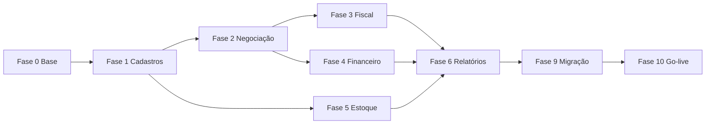

# Mapeamento e Plano de Implementação — Gestão Fácil → Ligeirinho HUB

> **Versão:** 1.0  
> **Data:** 2026-05-29  
> **Status:** Em execução — Fase 0 iniciada  
> **Público:** Agentes de desenvolvimento e equipe técnica  
> **Referências:** `docs/ARCHITECTURE.md`, `docs/REUNIAO_DENIS_ESTRUTURA.md`, `src/lib/apps.ts`

---

## Modo seguro — não quebrar o existente

Esta implantação **não substitui** PDV, Totem, Operacional ou Marketing. Seguir sempre:

| Regra | Detalhe |
|-------|---------|
| Migrations aditivas | `CREATE TABLE`, `ADD COLUMN ... NULL` — nunca `DROP` ou `NOT NULL` sem default na mesma fase |
| Apps novos ao lado | Fiscal, Financeiro, Estoque entram como novos `AppId`; rotas `/pdv`, `/operacional` intactas |
| Compat layer | `clientes` permanece até Fase 1b; novas entidades usam tabelas paralelas |
| PRs pequenos | Um submódulo ou fase por PR |
| Build obrigatório | `npm run build` antes de merge |
| Operação paralela | Gestão Fácil continua em produção até go-live (Fase 10) |
| Permissões incrementais | Novas rotas só para Admin/Gerente até estabilizar |

### O que NÃO fazer no início

1. Renomear rotas existentes (`/pdv`, `/operacional`, `/clientes`)
2. Alterar enums `pedido_status` sem migration de compatibilidade
3. Remover tabela `clientes`
4. Integrar Fiscal/Financeiro no PDV antes de módulo isolado estável

---

## Log de progresso

| Fase | Status | Branch / PR | Notas |
|------|--------|-------------|-------|
| **0 — Schema base** | ✅ Concluída | PR #2 | Migration + Cadastros base | `empresa_config`, cadastros auxiliares, colunas fiscais nullable em `produtos` |
| 1 — Cadastros | ✅ Concluída | PR #3 | Pessoas, tipos conta, contas bancárias |
| 2 — Gestão Produtos + Negociação | ✅ Concluída | PR #4 | Negociações comerciais, tabelas de preço, operações fiscais |
| 3 — Nota Eletrônica (Fiscal) | ✅ Concluída | `cursor/gf-fase3-fiscal-fdca` | App Fiscal, `notas_fiscais`, Edge `nfe-emitir` |
| 4 — Financeiro | ✅ Concluída | `cursor/gf-fase4-financeiro-fdca` | App Financeiro, contas a receber/pagar, comissões, vales |
| 5 — Controle Estoque | ✅ Concluída | `cursor/gf-fase5-estoque-fdca` | App Estoque, depósitos, saldos, movimentos, lotes |
| 6 — Relatórios + Dashboard | ✅ Concluída | `cursor/gf-fase6-relatorios-fdca` | Painel `/admin/relatorios`, RPCs vendas por hora e mensal fiscal |
| 7 — Catálogo Digital | ⚪ Pendente | — | |
| 8 — Configuração avançada | ⚪ Pendente | — | |
| 9 — Migração dados GF | ⚪ Pendente | — | |
| 10 — Go-live | ⚪ Pendente | — | |

---

## 0. Instruções para o agente executor

### 0.1 Regras obrigatórias

1. **Não embutir o Gestão Fácil** (iframe, link externo, SSO). Tudo nativo no HUB.
2. **Respeitar arquitetura:** apps em `src/lib/apps.ts`, rotas em `src/App.tsx`, APIs em `src/lib/{dominio}/api.ts`, schema em `supabase/migrations/`.
3. **Pedido único como núcleo:** vendas convergem em `pedidos` + `pedido_itens`.
4. **Permissões em 3 camadas:** cargo → `paginas_permitidas` → RLS.
5. **Commits temáticos:** um módulo ou submódulo por PR quando possível.

### 0.2 Ordem de execução global

```text
Fase 0 → Preparação e schema base
Fase 1 → Cadastros (fundamento)
Fase 2 → Gestão Produtos + Negociação
Fase 3 → Nota Eletrônica (Fiscal)
Fase 4 → Financeiro
Fase 5 → Controle Estoque
Fase 6 → Relatórios + Dashboard gerencial
Fase 7 → Catálogo Digital externo
Fase 8 → Configuração avançada + multi-empresa
Fase 9 → Migração de dados Gestão Fácil → Supabase
Fase 10 → Go-live e descomissionamento GF
```

### 0.3 Padrão para adicionar cada novo app

| Passo | Arquivo(s) |
|-------|------------|
| 1 | Estender `AppId` em `src/lib/apps.ts` |
| 2 | Adicionar entrada em `APPS_SISTEMA` com `itens[]` |
| 3 | Mapear rotas em `HUB_CARGOS_POR_ROTA` |
| 4 | Registrar rotas em `src/App.tsx` |
| 5 | Criar páginas em `src/pages/{app}/` |
| 6 | Criar API em `src/lib/{app}/api.ts` + types |
| 7 | Migration SQL em `supabase/migrations/` |
| 8 | RLS policies na migration |
| 9 | Atualizar types conforme necessário |
| 10 | Testes + `npm run build` |

---

## 1. Diagnóstico: Gestão Fácil vs Ligeirinho HUB

### 1.1 Cobertura atual (~25–30%)

| Módulo GF | Cobertura | App HUB destino |
|-----------|-----------|-----------------|
| Início (Home KPIs) | 20% | Hub Admin |
| Cadastros | 25% | Hub Admin |
| Gestão Produtos | 20% | Hub Admin + Marketing |
| Negociação | 40% | Operacional + PDV |
| Catálogo Digital | 30% | Totem + Marketing |
| Relatórios | 10% | Hub Admin (Visão Estratégica) |
| Nota Eletrônica | 15% | **App Fiscal** (novo) |
| Financeiro | 10% | **App Financeiro** (novo) |
| Controle Estoque | 5% | **App Estoque** (novo) |
| Segurança | 80% | Hub Admin (Usuários) |
| Configuração | 20% | Hub Admin (Sistemas) |

### 1.2 Apps novos a criar

| AppId | Nome exibido | Módulos GF |
|-------|--------------|------------|
| `fiscal` | Ligeirinho Fiscal | Nota Eletrônica |
| `financeiro` | Ligeirinho Financeiro | Financeiro |
| `estoque` | Ligeirinho Estoque | Controle Estoque |

---

## 2. Fase 0 — Preparação (INICIADA)

**Migration:** `supabase/migrations/20260529120000_gf_fase0_base.sql`

### Entregas

- [x] Tabela `empresa_config` (single-tenant, preparada para multi-CNPJ)
- [x] Tabelas auxiliares: `motivos`, `formas_pagamento`, `tipos_conta`, `contas_bancarias`
- [x] Colunas nullable em `produtos` (EAN, NCM, fiscal, estoque)
- [x] Seeds: formas de pagamento e motivos padrão
- [x] Admin: `/admin/cadastros-base` (motivos + formas de pagamento)
- [ ] Aplicar migration no Supabase remoto (`supabase db push`)

### Enums criados

- `gf_motivo_tipo`: cancelamento, devolucao, ocorrencia, desconto
- `gf_forma_pagamento_tipo`: dinheiro, pix, cartao_debito, cartao_credito, boleto, prazo
- `gf_regime_tributario`: simples, presumido, real
- `gf_tipo_conta_natureza`: receita, despesa

---

## 3. Fase 1 — Cadastros

> **Módulo GF:** Produtos, Pessoas, Motivos, Formas Pagamento, Tipos de Conta, Contas bancárias

### 3.1 Produtos (estender)

Campos adicionais já iniciados na Fase 0. Completar UI admin com abas Geral | Fiscal | Estoque.

### 3.2 Pessoas (nova tabela)

Migrar `clientes` → `pessoas` com compat layer — **não apagar `clientes`**.

```sql
-- pessoas: tipo[], cpf_cnpj, limite_credito, legacy_gf_id, etc.
-- View clientes_compat ou API wrapper em src/lib/clientes/api.ts
```

Rotas: `/admin/pessoas`

### 3.3 Motivos e Formas de Pagamento

Implementado parcialmente na Fase 0. Integrar `motivo_id` em `pedido_ocorrencias` na Fase 1b.

### 3.4 Tipos de Conta + Contas Bancárias

Tabelas criadas na Fase 0. Admin UI na Fase 1.

**Checklist agente Fase 1:**

- [ ] Migration `pessoas` + compat layer `clientes`
- [ ] `/admin/pessoas` CRUD
- [ ] Abas fiscal/estoque em produtos admin
- [ ] `/admin/tipos-conta`, `/admin/contas-bancarias`
- [ ] Integrar formas_pagamento no PDV (leitura dinâmica, fallback enum atual)

---

## 4. Fase 2 — Gestão Produtos + Negociação

### 4.1 Gestão Produtos (submenus GF)

| Submenu GF | Rota HUB sugerida |
|------------|-------------------|
| Etiquetas | `/admin/produtos/etiquetas` |
| Família de Produtos | tabela `familias_produto` |
| Ajuste Tributário | `regras_tributarias` |
| Promoção | estender `promocoes` |
| Grade | `produto_variacoes` (opcional) |
| Organização | `enderecos_estoque` |
| Ajustes Coletivos | `/admin/produtos/ajuste-coletivo` |

### 4.2 Negociação

Estender `pedidos` com: `operacao_fiscal_id`, `vendedor_id`, `tabela_preco_id`, `tipo_documento`, `desconto_total`, `frete_valor`.

Rotas:

- `/negociacao/nova` — Criar Negociação (layout GF)
- `/negociacao` — Lista
- `/negociacao/:id` — Detalhe

Componentes: `NegociacaoForm`, `NegociacaoItensGrid`, `NegociacaoAcoes`

Regras Denis: orçamento não entra na fila; preço congelado; bloqueio inadimplente.

---

## 5. Fase 3 — Nota Eletrônica (App Fiscal)

**AppId:** `fiscal`

| Submenu GF | Rota HUB |
|------------|----------|
| Emitir NF-e | `/fiscal/emitir` |
| Notas Emitidas | `/fiscal/emitidas` |
| Notas Recebidas | `/fiscal/recebidas` |
| Inutilizar Notas | `/fiscal/inutilizar` |
| Operações | `/fiscal/operacoes` |
| Números/Séries | `/fiscal/series` |

Tabelas: `series_fiscais`, `notas_fiscais`, `notas_fiscais_itens`, `operacoes_fiscais`

Edge Functions: expandir `nfce-emitir`; criar `nfe-emitir`, `nfe-cancelar`, `nfe-inutilizar`

Base: extrair `src/lib/pdv/fiscal.ts` → `src/lib/fiscal/api.ts`

---

## 6. Fase 4 — Financeiro (App Financeiro)

**AppId:** `financeiro`

| Submenu GF | Rota HUB |
|------------|----------|
| Conferência de Caixa | `/financeiro/caixa` (unificar com PDV) |
| Contas a Pagar | `/financeiro/pagar` |
| Contas a Receber | `/financeiro/receber` |
| Comissões | `/financeiro/comissoes` |
| Vales Descontos | `/financeiro/vales` |

Tabelas: `contas_financeiras`, `contas_financeiras_baixas`, `comissoes`, `vales_desconto`

Automações: gerar conta a receber em venda a prazo; marcar vencidas; atualizar `inadimplente`.

---

## 7. Fase 5 — Controle Estoque (App Estoque)

**AppId:** `estoque`

| Submenu GF | Rota HUB |
|------------|----------|
| Entrada Notas XML | `/estoque/entrada-xml` |
| Entrada e Saída | `/estoque/movimentos` |
| Conferência | `/estoque/inventario` |
| Conferência App | `/estoque/inventario/app` |

Tabelas: `estoque_depositos`, `estoque_saldos`, `estoque_movimentos`, `estoque_lotes`

Integração: saída na separação confirmada; entrada via XML fornecedor.

---

## 8. Fase 6 — Relatórios + Dashboard gerencial

Replicar Home GF (cards + gráficos):

| Card GF | Fonte |
|---------|-------|
| Vendas | `pedidos` concluídos |
| Contas a Receber/Pagar | `contas_financeiras` |
| Lotes e Validade | `estoque_lotes` |
| NF-e | `notas_fiscais` |
| Ticket Médio | AVG pedidos |
| Estoque crítico | `estoque_saldos` vs `estoque_minimo` |
| Clientes | `pessoas` |

Gráficos: vendas por hora; vendas mensais NF-e vs NFC-e (RPCs Supabase).

Menu Relatórios GF → `/admin/relatorios/*`

| Rota HUB | Conteúdo |
|----------|----------|
| `/admin/relatorios` | Painel gerencial (7 cards + 2 gráficos) |
| `/admin/relatorios/vendas` | Vendas por hora (filtro por data) |
| `/admin/relatorios/fiscal` | NF-e vs NFC-e mensal |

RPCs: `gf_relatorio_vendas_por_hora`, `gf_relatorio_vendas_mensais_fiscal`

API: `src/lib/relatorios/api.ts`

---

## 9. Fase 7 — Catálogo Digital

| Submenu GF | HUB |
|------------|-----|
| Entrega de Pedidos | Portal B2B ou extensão Operacional |
| Configurar Catálogo | Admin produtos visíveis + tabela de preço |

---

## 10. Fase 8 — Segurança + Configuração

Segurança ~80% coberta. Estender cargos: Vendedor, Fiscal, Estoquista dedicados.

Configuração GF → `/admin/config/*` (caixas, empresas, envio XML)

---

## 11. Fase 9 — Migração dados GF → Supabase

Ordem de importação:

```text
1. empresa_config
2. formas_pagamento, tipos_conta, motivos, operacoes_fiscais
3. familias_produto, categorias_produto
4. produtos (+ fiscal)
5. pessoas (clientes, fornecedores, vendedores)
6. tabelas_preco
7. series_fiscais, estoque_saldos
8. pedidos abertos, notas_fiscais, contas em aberto
```

Scripts: `scripts/migracao-gf/` com dry-run e validação pós-migração.

---

## 12. Fase 10 — Go-live

Critérios:

- Loja opera pedido → separação → entrega no HUB
- PDV emite NFC-e em produção
- Contas a receber refletem inadimplência
- Nenhum pedido novo no GF por 7 dias

---

## 13. Matriz de permissões sugerida

| App / área | CEO | Admin | Gerente | Vendedor | Operador | Financeiro |
|------------|-----|-------|---------|----------|----------|------------|
| Hub Admin | ✅ | ✅ | parcial | ❌ | ❌ | parcial |
| Operacional | ✅ | ✅ | ✅ | ✅ | ✅ | ❌ |
| Negociação | ✅ | ✅ | ✅ | ✅ | ❌ | ❌ |
| PDV | ✅ | ✅ | ✅ | ✅ | ✅ | ❌ |
| Fiscal | ✅ | ✅ | ✅ | ❌ | ❌ | ✅ |
| Financeiro | ✅ | ✅ | ✅ | ❌ | ❌ | ✅ |
| Estoque | ✅ | ✅ | ✅ | ❌ | ✅ | ❌ |

---

## 14. Dependências entre fases



---

## 15. Riscos e mitigações

| Risco | Mitigação |
|-------|-----------|
| GF sem API export | CSV manual + scripts |
| NF-e rejeição SEFAZ | Homologação; GF paralelo |
| Escopo ERP completo | Fases 0–4 primeiro |
| Multi-CNPJ | Fase 8 |

---

## 16. Definição de pronto por fase

1. Migration aplicada (staging/prod)
2. Páginas + RLS funcionais
3. Permissões configuradas
4. `npm run build` OK
5. PR mergeado

---

## 17. Referência — arquivos HUB existentes

| Domínio | Arquivos |
|---------|----------|
| Apps | `src/lib/apps.ts` |
| Rotas | `src/App.tsx` |
| Pedidos | `src/lib/pedidos/api.ts` |
| PDV / Fiscal NFC-e | `src/lib/pdv/`, `supabase/functions/nfce-emitir` |
| Admin | `src/lib/admin/`, `src/pages/admin/` |
| Cadastros GF (Fase 0) | `src/lib/cadastros/api.ts`, `src/pages/admin/CadastrosBasePage.tsx` |
| Migrations | `supabase/migrations/` |

---

## 18. Próxima tarefa do agente (Fase 1)

```bash
git checkout main && git pull
git checkout -b cursor/gf-fase1-cadastros-fdca
# Migration pessoas + compat clientes
# /admin/pessoas CRUD
# Abas fiscal em produtos admin
npm run build
```

---

*Documento vivo — atualizar log de progresso a cada fase concluída.*
